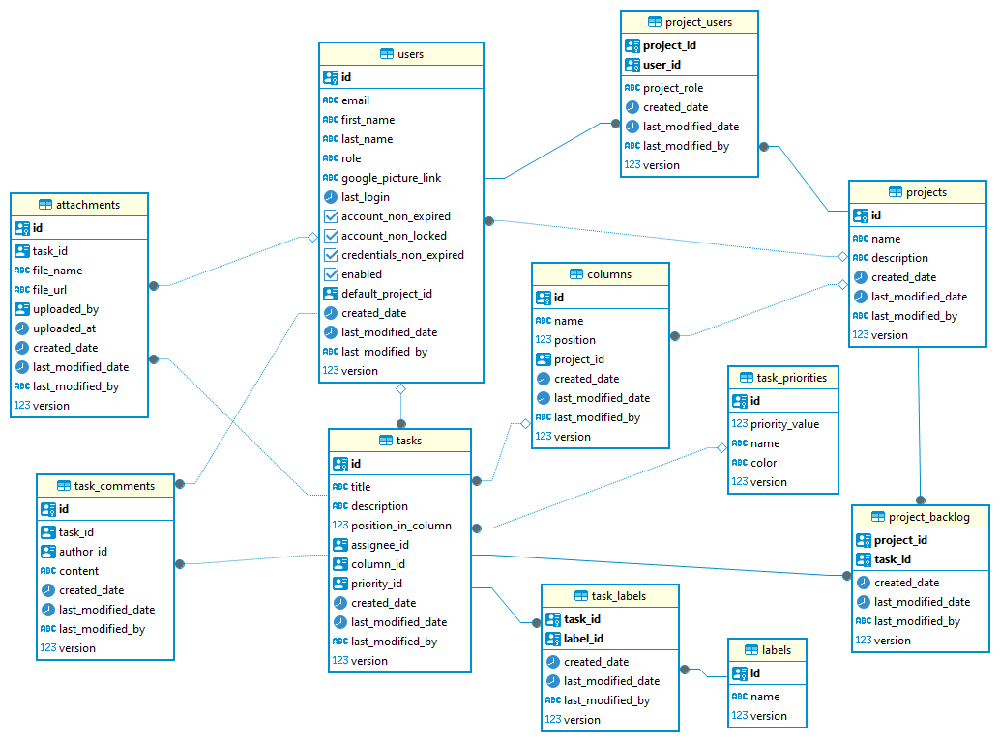

### Run app in debug mode:
```
mvn spring-boot:run -Ddebug
```

### To run postgres db:
```
docker run -d --name project-chaos -e POSTGRES_DB=project-chaos -e POSTGRES_USER=admin -e POSTGRES_PASSWORD=admin123 -p 5432:5432 postgres:15
```

## Current Database Schema
As of 23.04.2025



## Docs
### Liquibase
```https://contribute.liquibase.com/extensions-integrations/directory/integration-docs/springboot/configuration/```

## Other
### Test folder structure
```
https://blog.worldline.tech/2020/04/10/split-unit-and-integration-tests.html
```
