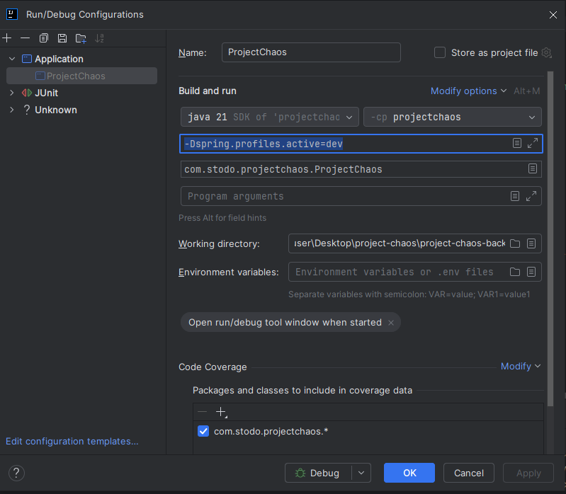
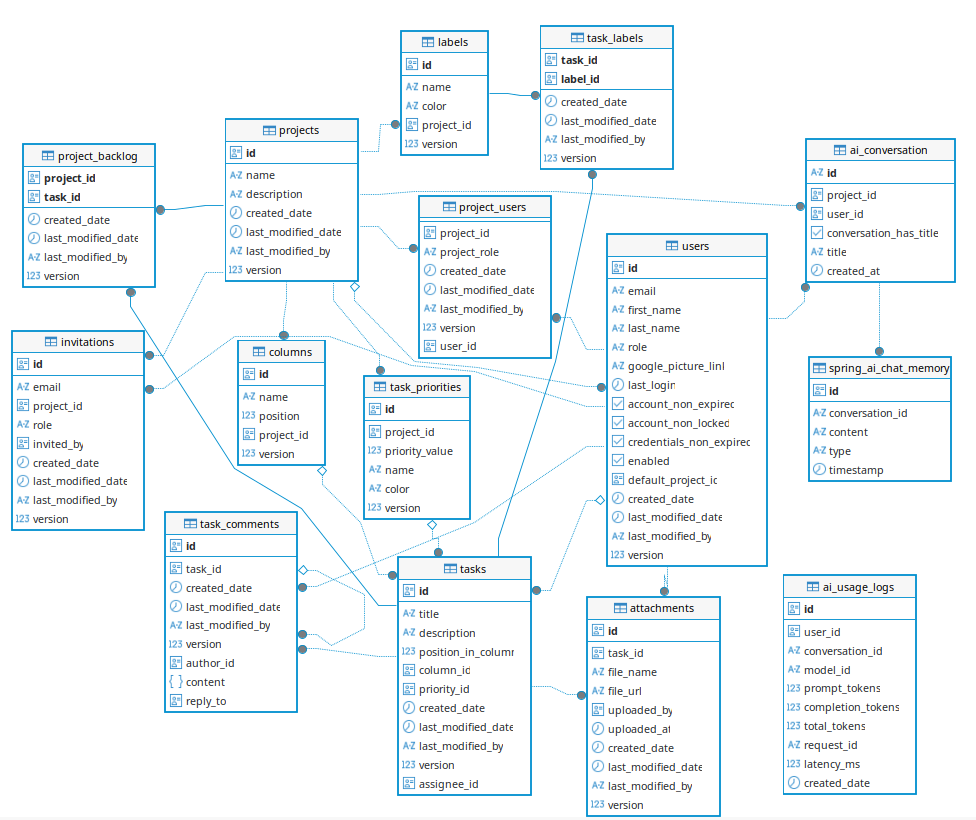

# Run

## To run postgres db (do this for local development):

```
docker run -d --name project-chaos -e POSTGRES_DB=project-chaos -e POSTGRES_USER=admin -e POSTGRES_PASSWORD=admin123 -p 5432:5432 postgres:15
```

## Run app locally - dev profile

Add -Dspring.profiles.active=dev as **VM Options**:


# Current Database Schema



tasks.column_id == null ? -> task is in project_backlog

# Workflows / Pipelines

### CI

**.github/workflows/ci.yml**  
Runs mvn test on push or pull request to main.

### CD

**.github/workflows/cd.yml**  
Builds docker image on tag push [only main branch should be tagged].  
Then, it tags the image with the same tag as the git tag + latest.  
Finally, it pushes it to GCP Artifact Registry.

**Example:**

```declarative
git tag 1.32.5
git push origin 1.32.5
```

# Docs

## Liquibase

`https://contribute.liquibase.com/extensions-integrations/directory/integration-docs/springboot/configuration/`

# Other

## Test folder structure

```
https://blog.worldline.tech/2020/04/10/split-unit-and-integration-tests.html
```

## Cloud SQL

```
https://codelabs.developers.google.com/codelabs/cloud-spring-petclinic-cloudsql#0
```

## To build app and run it in docker (do this to test that container is built correctly):

```
docker build -t project-chaos-backend .

docker network create project-chaos-network

docker run -d --name project-chaos-db --network project-chaos-network -e POSTGRES_DB=project-chaos -e POSTGRES_USER=admin -e POSTGRES_PASSWORD=admin123 -p 5432:5432 postgres:15

docker run --network project-chaos-network -p 8080:8080 --env SPRING_PROFILES_ACTIVE=dev --env-file project-chaos-backend-env.env --env SPRING_DATASOURCE_URL=jdbc:postgresql://project-chaos-db:5432/project-chaos --env SPRING_DATASOURCE_USERNAME=admin --env SPRING_DATASOURCE_PASSWORD=admin123 project-chaos-backend
```

project-chaos-backend-env.env - file with env variables like:

- GOOGLE_OAUTH2_CLIENT_ID
- GOOGLE_OAUTH2_CLIENT_SECRET
- SOCIAL_JWT_SECRET

## Manually deploy helm chart on GCP
1. Connect with cluster  
```gcloud container clusters get-credentials [gke-cluster-name] --region=[cluster-region]```


2. install helm chart    
   ```helm install project-chaos ./helm```
