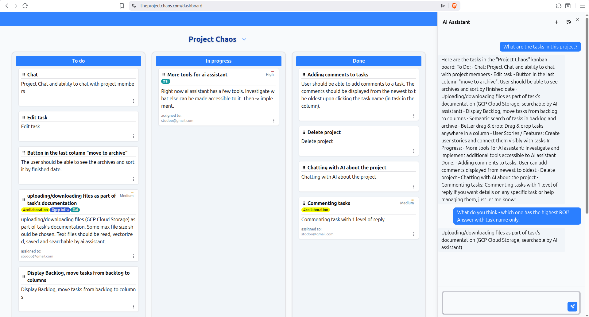
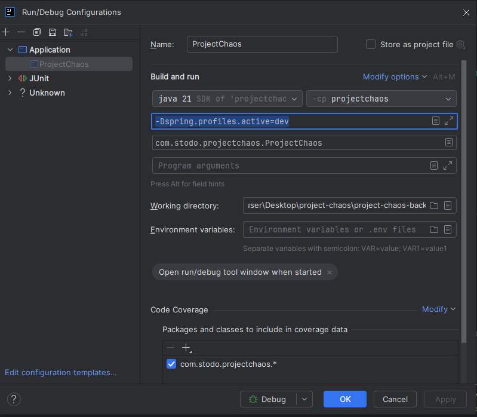
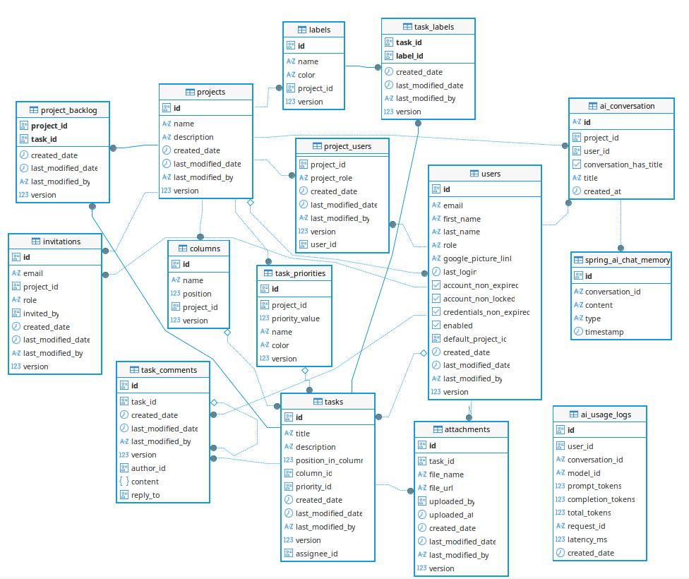

# The Project Chaos
The Project Chaos is a Kanban-style task board.  
It lets users organize tasks across columns, work with other people on shared projects,
and assign different member roles to control access and responsibilities.

Frontend Repository: https://github.com/stodolkiewicz/project-chaos-frontend




# How to start local development

### To run postgres db:
From the project top-level directory
```
docker compose up -d
```

alternatively,
```
docker run -d --name project-chaos -e POSTGRES_DB=project-chaos -e POSTGRES_USER=admin -e POSTGRES_PASSWORD=admin123 -p 5432:5432 pgvector/pgvector:pg15
```

### Set up dev profile

Add -Dspring.profiles.active=dev as **VM Options**:


### Lombok
Make sure that you have enabled **annotation processing** in the IDE and have an active, installed **Lombok plugin**.

### Env Variables
You will need the following env variables to run the app locally:
- GOOGLE_OAUTH2_CLIENT_ID
- GOOGLE_OAUTH2_CLIENT_SECRET
- JWT_SECRET
- SPRING_AI_OPENAI_API_KEY  
  (for uploading documents to Google Cloud Storage)
- GCP_PROJECT_ID
- GCP_BUCKET_NAME

To generate JWT_SECRET on ubuntu/linux you can use:
> openssl rand -base64 64

For devs of this project: The rest of the variables can be found in Secret Manager in the GCP project.

You can add those variables to Intellij's run configuration as environment variables.

### Access Token
--- DEV ACCESS TOKEN --- is printed in the console on application start.

Alternatively, you can get JWT access token by starting frontend and backend, logging in and extracting access_token cookie value.

# Current Database Schema



tasks.column_id == null ? -> task is in project_backlog

# Workflows / Pipelines

### CI

**.github/workflows/ci.yml**  
Runs mvn test on push or pull request to main.

### CD

**.github/workflows/cd-for-cloud-run.yml**  
Builds docker image on tag push [only main branch should be tagged].  
Then, it tags the image with the same tag as the git tag + latest.  
Finally, it pushes it to GCP Artifact Registry.

**Example:**
0. Commit and push your changes

1. Check if all tests pass
```
./mvnw clean install
```

2. Check the last tag on the main branch (on which you are on)
```
git describe --tags --abbrev=0 // 1.32.4
```

3. Tag appropriately and push the tag
```declarative
git tag 1.32.5
git push origin 1.32.5
```

# Design Decisions

This project documents non-obvious technical decisions as ADRs (Architecture Decision Records).
See [docs/design-decisions](./docs/design-decisions) for the full list.

# Architecture
