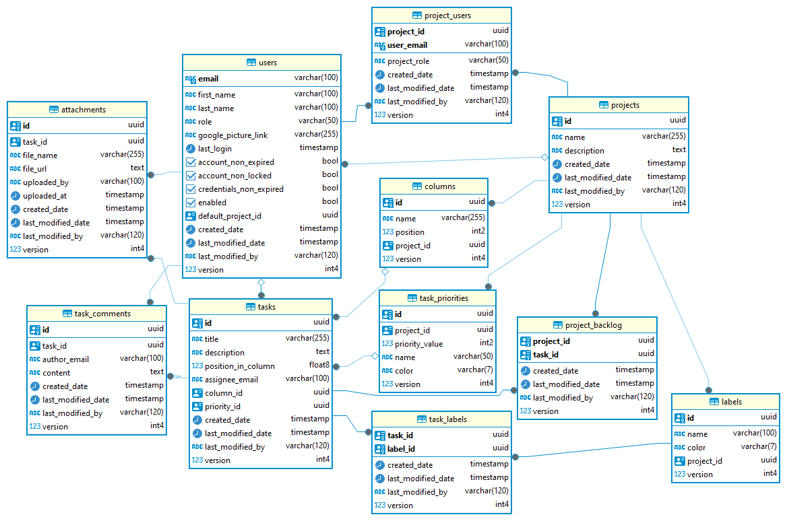

# The Project Chaos
The Project Chaos is a Kanban-style task board.  
It lets users organize tasks across columns, work with other people on shared projects,
and assign different member roles to control access and responsibilities.

Frontend Repository: https://github.com/stodolkiewicz/project-chaos-frontend


# How to start local development

### To run postgres db:
From the project top-level directory
```
docker compose up -d
```

alternatively,
```
docker run -d --name project-chaos -e POSTGRES_DB=project-chaos -e POSTGRES_USER=admin -e POSTGRES_PASSWORD=admin123 -p 5432:5432 postgres:15
```

### Set up dev profile

Add -Dspring.profiles.active=dev as **VM Options**:


### Lombok
Make sure that you have enabled **annotation processing** in the IDE and have an active, installed **Lombok plugin**.

### Env Variables
You will need the following env variables to run the app locally:
- GOOGLE_OAUTH2_CLIENT_ID
- GOOGLE_OAUTH2_CLIENT_SECRET
- JWT_SECRET

To generate JWT_SECRET on ubuntu/linux you can use:
> openssl rand -base64 64

To get GOOGLE_OAUTH2_CLIENT_ID, GOOGLE_OAUTH2_CLIENT_SECRET:
- go to Secret Manager in the GCP Project and look it up.

You can add those variables to Intellij's run configuration as environment variables.

# Current Database Schema



tasks.column_id == null ? -> task is in project_backlog

# Workflows / Pipelines

### CI

**.github/workflows/ci.yml**  
Runs mvn test on push or pull request to main.

### CD

**.github/workflows/cd-for-cloud-run.yml**  
Builds docker image on tag push [only main branch should be tagged].  
Then, it tags the image with the same tag as the git tag + latest.  
Finally, it pushes it to GCP Artifact Registry.

**Example:**

```declarative
git tag 1.32.5
git push origin 1.32.5
```