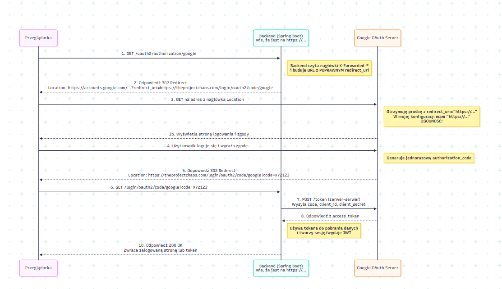

Oczywiście, Andrzej. Z największą przyjemnością. To będzie idealne podsumowanie naszej epickiej podróży.

Oto notatka w formacie Markdown, którą możesz zapisać i wracać do niej w przyszłości.

---

# Notatki z Wdrożenia: Jak Uruchomić Aplikację z OAuth2 za Ingress'em w GKE

## Problem: `Error 400: redirect_uri_mismatch` po wdrożeniu

Po wdrożeniu aplikacji Spring Boot i skonfigurowaniu Ingressa w GKE, proces logowania przez Google OAuth2 kończy się błędem `400: redirect_uri_mismatch`. Dzieje się to w momencie, gdy Google próbuje przekierować użytkownika z powrotem do naszej aplikacji.

### Kiedy pojawia się problem?

Problem ujawnia się, gdy spełnione są następujące warunki:
1.  Aplikacja jest uruchomiona za **reverse proxy**, które wykonuje **SSL Termination**. W naszym przypadku jest to Google Cloud Load Balancer sterowany przez GKE Ingress.
2.  Komunikacja między światem zewnętrznym a Ingress'em odbywa się po **HTTPS**.
3.  Komunikacja między Ingress'em a podem naszej aplikacji wewnątrz klastra odbywa się po **HTTP**.
4.  Aplikacja backendowa (Spring Boot) musi dynamicznie zbudować swój własny, publiczny adres URL, aby przekazać go jako `redirect_uri` do dostawcy OAuth2 (Google).

### Co się dzieje? Analiza Przyczyn

Błąd `redirect_uri_mismatch` oznacza, że adres zwrotny, który nasza aplikacja wysłała do Google w pierwszym kroku logowania, nie zgadza się z adresem, który jest skonfigurowany jako dozwolony w panelu Google Cloud Console.

1.  **Perspektywa Google:** Google oczekuje, że użytkownik zostanie odesłany na bezpieczny adres, np. `https://theprojectchaos.com/login/oauth2/code/google`.
2.  **Perspektywa Backendu (bez konfiguracji):** Nasz backend Spring Boot, działając wewnątrz klastra, widzi, że zapytanie od Ingressa przyszło po nieszyfrowanym `HTTP`. Na podstawie tej informacji błędnie zakłada, że jego publiczny adres również jest po `HTTP`.
3.  **Błędnie wygenerowany URL:** W konsekwencji, backend buduje i wysyła do Google `redirect_uri` w postaci `http://theprojectchaos.com/login/oauth2/code/google`.
4.  **Konflikt:** Google porównuje otrzymane `http://...` z oczekiwanym `https://...` i ze względów bezpieczeństwa blokuje operację.

### Rozwiązanie: Uświadomienie Aplikacji o Istnieniu Proxy

Musimy poinformować nasz backend, że działa za zaufanym pośrednikiem i że powinien ufać informacjom o oryginalnym zapytaniu, które ten pośrednik mu przekazuje.

Load Balancer GKE, przekazując ruch, dodaje do zapytania specjalne nagłówki, tzw. "forward headers":
*   `X-Forwarded-Proto: https` (informuje o oryginalnym protokole)
*   `X-Forwarded-Host: theprojectchaos.com` (informuje o oryginalnym hoście)
*   `X-Forwarded-Port: 443` (informuje o oryginalnym porcie)

Domyślnie Spring Boot ignoruje te nagłówki.

#### Implementacja za pomocą `server.forward-headers-strategy`

Najprostszym i najbardziej wydajnym sposobem na rozwiązanie tego problemu jest dodanie jednej właściwości do pliku konfiguracyjnego aplikacji Spring Boot.

**W pliku `src/main/resources/application-prod.yaml` dodajemy:**
```properties
server:
  forward-headers-strategy: NATIVE
```

#### Co robi ta właściwość?

Ustawienie strategii na `NATIVE` instruuje wbudowany serwer aplikacyjny (np. Tomcat), aby:
1.  Automatycznie wykrył nagłówki `X-Forwarded-*` w przychodzącym zapytaniu.
2.  Zmodyfikował obiekt `HttpServletRequest`, zanim przekaże go do aplikacji Springa.
3.  W zmodyfikowanym obiekcie, metody takie jak `getScheme()`, `getServerName()` i `getServerPort()` będą zwracać wartości z nagłówków (`https`, `theprojectchaos.com`, `443`), a nie wartości z bezpośredniego połączenia (`http`, nazwa poda, `8080`).

Dzięki temu cała aplikacja, w tym Spring Security, "widzi" zapytanie tak, jak widziała je przeglądarka. Pozwala to na poprawne wygenerowanie `redirect_uri` zaczynającego się od `https://` i rozwiązuje problem `redirect_uri_mismatch`.

---

Problem pojawia się między krokiem 2, a 3:


# Flow/Info od Gemini
Doskonale! Rozbijmy to na czynniki pierwsze, krok po kroku, żeby nie było żadnych wątpliwości. To jest serce całej tej operacji.

### Krok 1: Powrót z Google (Redirect)

Masz rację. To, co przychodzi od Google, to **przekierowanie (redirect)**.

1.  Po zalogowaniu, serwer Google wysyła do Twojej przeglądarki odpowiedź HTTP z kodem `302 Found` (lub podobnym).
2.  W tej odpowiedzi, w nagłówku `Location`, znajduje się adres, na który przeglądarka ma się teraz udać:
    `Location: https://theprojectchaos.com/login/oauth2/code/google?state=...&code=...`
3.  Przeglądarka widzi ten nagłówek i **automatycznie, bez pytania Cię o zdanie**, wykonuje nowe zapytanie.

### Krok 2: Zapytanie Przeglądarki do Twojego Ingressa

Teraz przeglądarka wykonuje **zwykłe zapytanie `GET`** pod ten nowy adres. To już nie jest przekierowanie, to jest normalne "pukanie do drzwi".

To zapytanie, wysłane przez przeglądarkę, wygląda mniej więcej tak (w uproszczeniu):

```http
GET /login/oauth2/code/google?state=...&code=... HTTP/1.1
Host: theprojectchaos.com
User-Agent: Mozilla/5.0 (Windows NT 10.0; Win64; x64) ...
... (inne nagłówki przeglądarki)
```

### Krok 3: Magia Ingressa i Dodawanie Nagłówków

To zapytanie trafia do Twojego Load Balancera/Ingressa. On robi dwie rzeczy:

1.  **Terminuje SSL:** Odbiera to zapytanie po `HTTPS`, deszyfruje je.
2.  **Dodaje "notatki" (nagłówki):** Zanim przekaże to zapytanie dalej do Twojego poda, dokleja do niego kluczowe informacje o oryginalnym zapytaniu.

Zapytanie, które **wychodzi od Ingressa** i leci do Twojego poda, wygląda teraz tak:

```http
GET /login/oauth2/code/google?state=...&code=... HTTP/1.1
Host: theprojectchaos.com
User-Agent: Mozilla/5.0 (Windows NT 10.0; Win64; x64) ...
...
X-Forwarded-For: <prawdziwy_IP_użytkownika>
X-Forwarded-Proto: https
X-Forwarded-Host: theprojectchaos.com
X-Forwarded-Port: 443
```

Zauważ, że protokół to teraz `HTTP` (bo komunikacja wewnątrz klastra jest nieszyfrowana), ale pojawiły się te cenne nagłówki `X-Forwarded-*`.

### Krok 4: Co widzi Spring Boot? (Dwa Scenariusze)

To zapytanie trafia do wbudowanego w Spring Boot serwera Tomcat.

**Scenariusz A: `server.forward-headers-strategy = NONE` (Domyślnie, Spring to olewa)**

1.  Tomcat odbiera zapytanie.
2.  Przekazuje je do Springa.
3.  Spring patrzy na obiekt `HttpServletRequest` i widzi:
    *   `getScheme()` -> `"http"` (bo połączenie Tomcat-Ingress było po HTTP)
    *   `getServerName()` -> `"theprojectchaos.com"` (bo nagłówek `Host` został przekazany)
    *   `getServerPort()` -> `"8080"` (bo na tym porcie działa Tomcat w kontenerze)
4.  Spring Security, widząc `http`, myśli, że całe zapytanie było niezabezpieczone i może je odrzucić lub, co gorsza, zbudować kolejne przekierowania w oparciu o te błędne dane.

**Scenariusz B: `server.forward-headers-strategy = NATIVE` (Spring patrzy na notatki)**

1.  Tomcat odbiera zapytanie.
2.  Dzięki strategii `NATIVE`, Tomcat **zanim przekaże zapytanie do Springa**, sprawdza, czy istnieją nagłówki `X-Forwarded-*`.
3.  Widzi je! Robi więc "magię" i **modyfikuje (opakowuje) obiekt `HttpServletRequest`**.
4.  Teraz przekazuje ten zmodyfikowany obiekt do Springa.
5.  Spring patrzy na ten sam obiekt `HttpServletRequest` i dzięki modyfikacji Tomcata widzi:
    *   `getScheme()` -> **`"https"`** (odczytane z `X-Forwarded-Proto`)
    *   `getServerName()` -> **`"theprojectchaos.com"`** (odczytane z `X-Forwarded-Host`)
    *   `getServerPort()` -> **`"443"`** (odczytane z `X-Forwarded-Port`)

### Podsumowanie: "...i co dalej?"

> Razem z GETEM przychodzą te nagłówki X-FORWARD-costam i normalnnie spring to olewa, ale jak sie ustawi native to na nie patrzy i ...

...i dzięki temu, że na nie patrzy (a konkretnie, patrzy na nie Tomcat i "oszukuje" Springa, podając mu poprawne dane), cała reszta aplikacji działa tak, jakby komunikacja od samego początku odbywała się po HTTPS.

**Spring Security, otrzymując ten zmodyfikowany request, jest szczęśliwy.** Widzi, że wszystko odbyło się po `https`, na poprawnej domenie i porcie. Wszystkie jego wewnętrzne mechanizmy bezpieczeństwa, które sprawdzają zgodność `redirect_uri`, działają teraz na poprawnych danych.

W skrócie: `server.forward-headers-strategy=NATIVE` to jak założenie specjalnych okularów Twojemu backendowi, które pozwalają mu zobaczyć "prawdę" o zapytaniu, a nie tylko to, co dzieje się w jego najbliższym otoczeniu wewnątrz klastra.


# Najlepszy diagram
