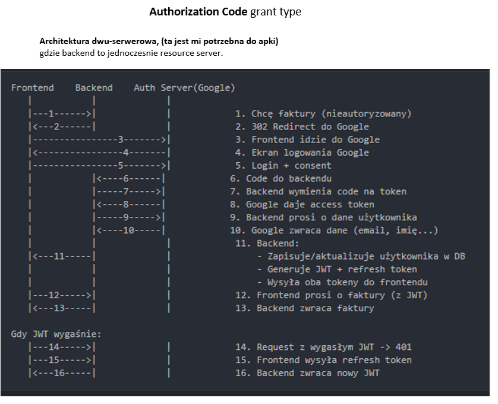
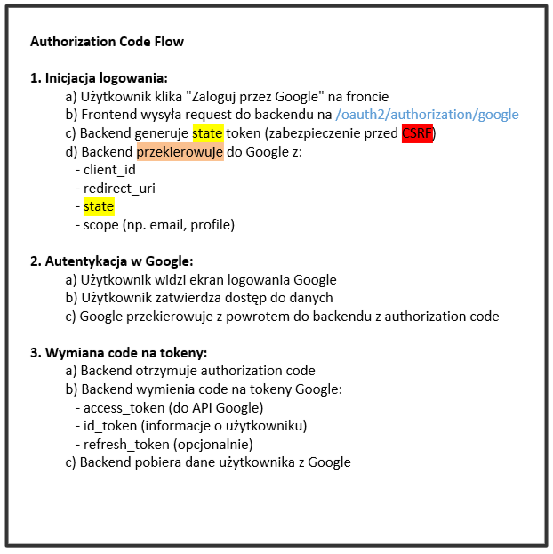
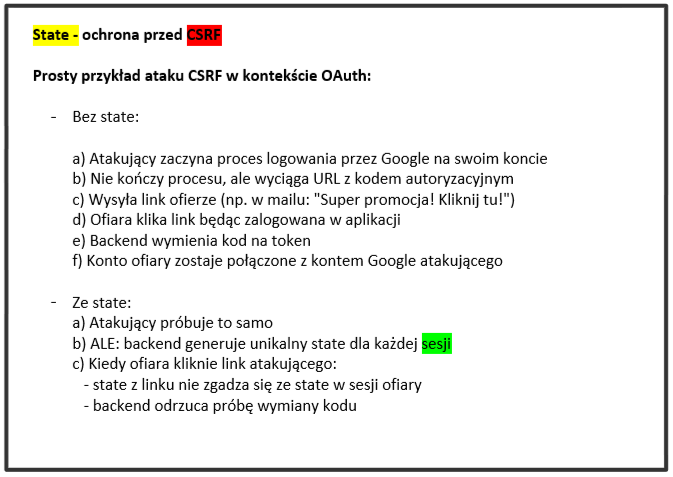

## Authorization Code Grant Type
How it looks like:

6,7 = authorization code  
7 = access token  
Token refresh is not done right now.

## Another example:

How is CSRF protection done in oauth2:  
